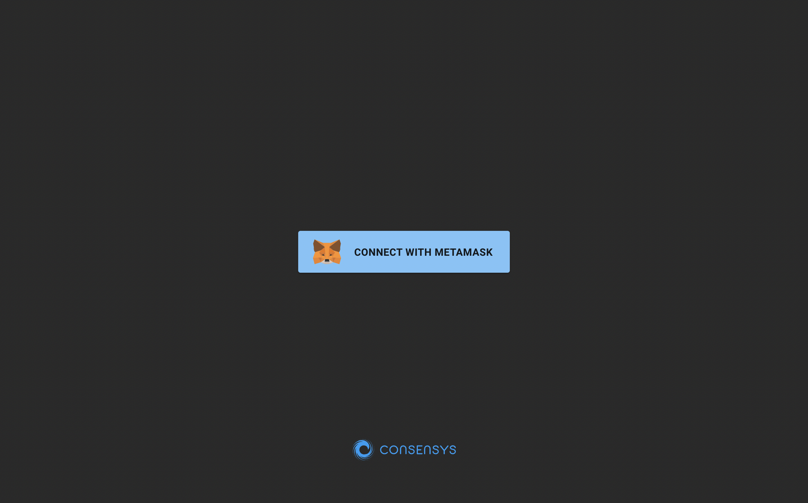
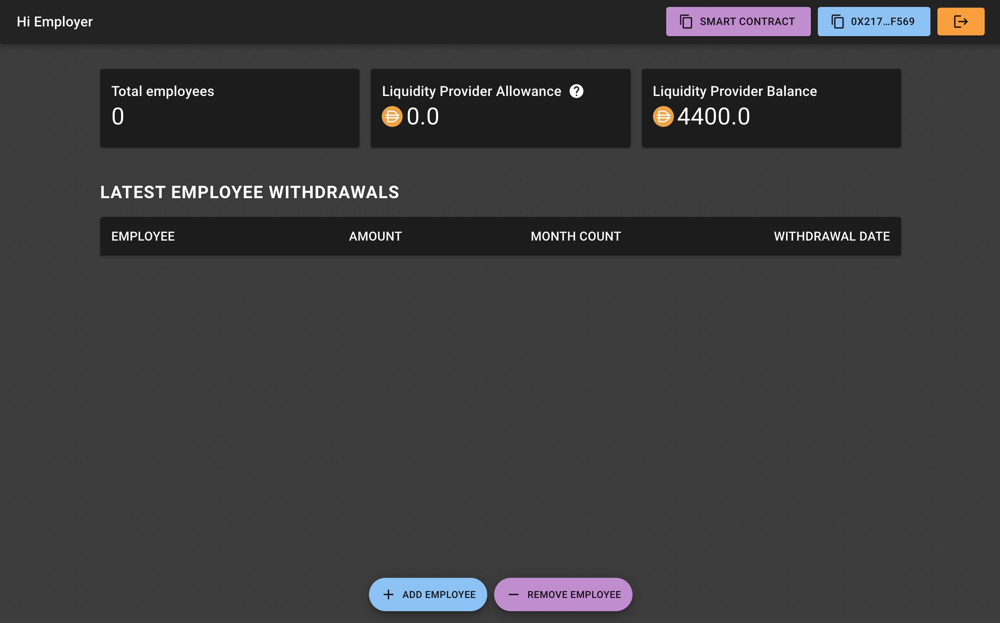
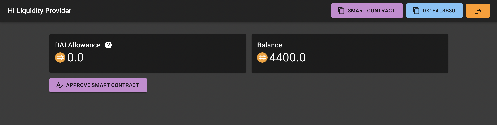
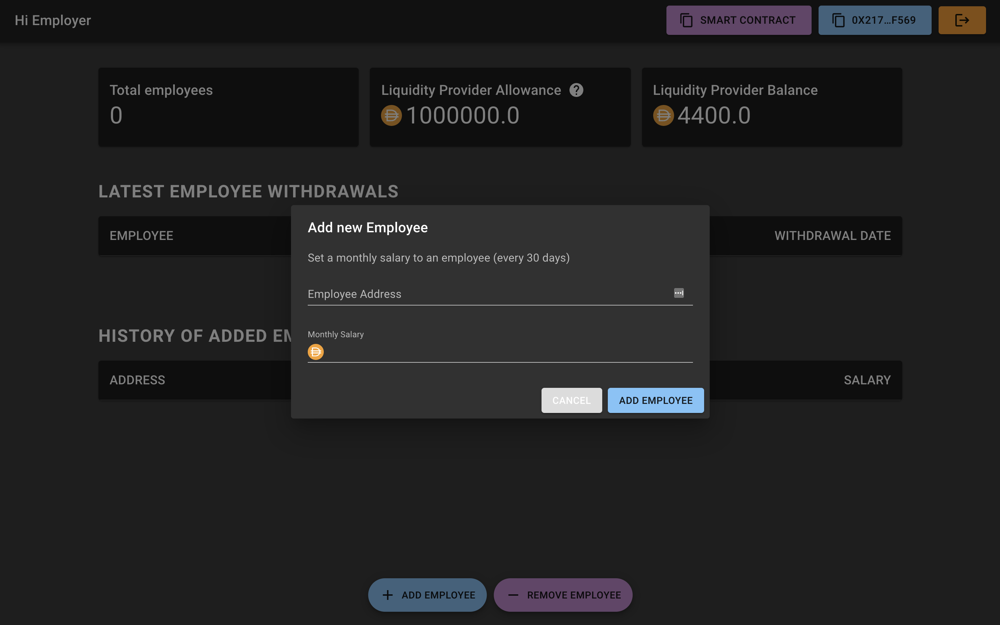
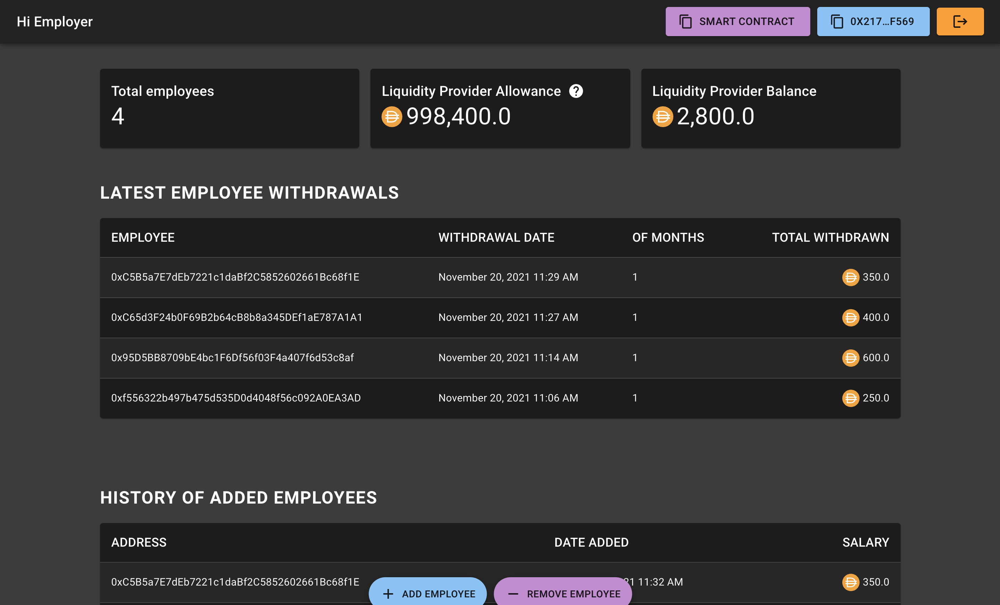

# Frontend React

### Website available here: [blockchain-developer-bootcamp-final-project-marcogianni.vercel.app/](https://blockchain-developer-bootcamp-final-project-marcogianni.vercel.app/)

## Usage & Configuration


The frontend is structured in such a way that only certain users can view informations. 
If instead you intend to deploy a new smart contract you must then update the frontent project and follow the following steps.

1. Update address of `SalariesProxy.js` in `src/contracts`  
2. Update address of `Salaries.js` in `src/contracts`


ABIs should remain the same.
The next step is the creation of the `.env` file.
## 🔑 ENV FILE

Create an `.env` file on project root. Here the path:
```
blockchain-developer-bootcamp-final-project/frontent-react/.env
```

The env file shoud contain:
```
REACT_APP_EMPLOYER_ADDRESS=""                 # contract owner
REACT_APP_LIQUIDITY_PROVIDER_ADDRESS=""       # liquidity provider
```

Environment variables allow different views in the UI, you need to know in advance who is viewing the page.

In `src/Front.js` 

```javascript
if (!active) {
    return <ConnectPage />;
}

if (account === process.env.REACT_APP_EMPLOYER_ADDRESS) {
    return <EmployerPage />;
}

if (account === process.env.REACT_APP_LIQUIDITY_PROVIDER_ADDRESS) {
    return <LiquidityProviderPage />;
}

return <UserPage />;
```
Addresses that have an associated salary will be able to see their monthly salary and withdrawal history. 

Those who do not receive a salary and therefore are not an employee see only warning message.

---

The project contains `.nvmrc` file with node version to use. Please run:
```
nvm use
```

Then install packages:
```
yarn
```

And then
```
yarn start
```


## 🖥️ Screenshots

The application looks like this at first startup.



The contract owner, by connecting with Metamask to the Rinkeby network can have access to all information.

Employer can see:
1. Total number of employees receiving a salary in DAI tokens
2. The liquidity provider allowance. Allows the employer to make sure the contract is authorized to spend the liquidity provider's DAI for that amount.
3. The total balance that the liquidity provider owns.
4. One button to add an employee and one to remove an employee.



If the liquidity provider also connects its wallet, an "Approve Smart Contract" button appears, allowing you to set an allowance value.



The dialog to add a new employee:



On the main page the employer will be able to see their employees' payroll withdrawals and a history of adding or removing them.

